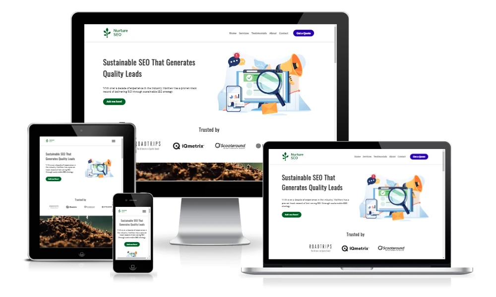
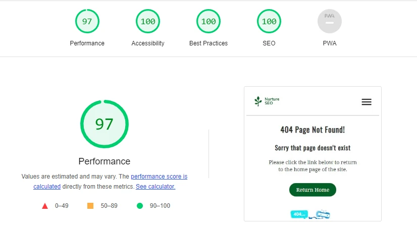

# Nurture SEO
(Developer: Matthew Shepherd)

[Live webpage](https://mat-shepherd.github.io/ci-pp1-nurture-seo/)

        

## Table of Contents

1. [Project Goals](#project-goals)
    1. [Business Goals](#business-goals)
    2. [User Goals](#user-goals)
2. [User Experience](#user-experience)
    1. [Target Audience](#target-audience)
    2. [User Requirements and Expectations](#user-requirements-and-expectations)
    3. [User Stories](#user-stories)
3. [Design](#design)
    1. [Design Choices](#design-choices)
    2. [Colours](#colours)
    3. [Fonts](#fonts)
    4. [Structure](#structure)
    5. [Wireframes](#wireframes)
4. [Technologies Used](#technologies-used)
    1. [Languages](#languages)
    2. [Frameworks & Tools](#frameworks--tools)
5. [Features](#features)
    1. [Existing Features](#existing-feature)
    2. [Features Left to Implement](#features-left-to-implement)
6. [Testing](#testing)
    1. [HTML Validation](#HTML-validation)
    2. [CSS Validation](#CSS-validation)
    3. [Accessibility](#accessibility)
    4. [Performance](#performance)
    5. [Device testing](#device-testing)
    6. [Browser compatibility](#browser-compatability)
    7. [Testing user stories](#testing-user-stories)
8. [Bugs](#Bugs)
9. [Deployment](#deployment)
10. [Credits](#credits)
11. [Acknowledgements](#acknowledgements)

## Project Goals 
The goals of this website include:

### Business Goals
- Increase brand awareness
- Convey the expertise, capabilities, and track record of the consultant to build trust in the brand
- Increase qualified leads for the consultant's services
- Build an SEO-optimised website with a great user experience to increase our search engine visibility and showcase the quality of the consultant's work

### User Goals
- Find a consultant that provides SEO services that align with their business goals and budget
- Understand the services provided by the consultant
- Find proof of work that the consultant can deliver the results desired
- Contact the consultant to request more details on the services provided and request a proposal

[Back to Table of Contents](#table-of-contents)

## User Experience

### Target Audience
- Medium to large-sized business owners in the UK, Ireland and North America
- Marketing managers of medium to large-sized businesses in the UK, Ireland and North America
- Sales managers of medium to large-sized businesses in the UK, Ireland and North America

### User Requirements and Expectations
- An intuitive and easy to locate navigation system regardless of screen size
- Ability to quickly find relevant information on the business and its services
- Quick and easy ways to contact the business
- A visually appealing and intuitively structured website that works well and is easy to read on all screen sizes
- Informative and relevant content that is easy to locate and read
- A website that loads quickly on all devices and connections
- A website that is accessible to all users 

### User Stories
I have divided my user stories into prospective customers, existing customers, and site owners, as each of these users will have a distinct set of needs and goals.

#### Prospective Customers
1. As a prospective customer, I want to see a list of the services offered by the consultant so that I can understand if the consultant can provide the solution my business is seeking.
2. As a prospective customer, I want to see a description of each service so I can understand the services provided.
3. As a prospective customer, I want to see details of the consultant's customers so I can feel confident that the consultant can deliver results for a business like mine.
4. As a prospective customer, I want to see details of the consultant's work experience and expertise to understand if they have the expertise required to handle my project.
5. As a prospective customer, I want to submit questions or details of my project through the website so I can connect with the consultant to discuss my project and receive answers, set up, a call or receive a project proposal.
6. As a prospective customer, I want to locate the consultant's contact details so I can see where they are located and phone or email them about my project and any questions I may have.
7. As a prospective customer, I want to locate the consultant's social media details so I can see if they are thought leaders in the space, learn from their content and see what other social media users say about them.

#### Existing Customers
8. As an existing customer, I want to locate the consultant's contact details or reach out to them directly through the website so I can request assistance or enquire about additional services.
9. As an existing customer, I want to locate the consultant's social media details so I can follow them and learn about SEO industry trends and tips and tricks to improve my site's performance.

#### Site Owner 
10. As a site owner, I want users to be able to see a list of my services and quickly contact me to request pricing.
11. As a site owner, I want users to see a list of my most recent clients and client testimonials to build trust and help convert more prospective customers.
12. As a site owner, I want users to be able to contact me directly through the website.
13. As the site owner, I want to make sure users are directed back to the index page of the website and do not use their browser's back button should they come across a 404 page not found error.

[Back to Table of Contents](#table-of-contents)

## Design

### Design Choices
I researched other digital marketing agency websites to find a bright, clean, and simple layout that fit my desired content and that was also responsive. I based my site design on the layout of [Workhu's](https://workhu.com/) website.

The imagery used on the site was chosen to convey growth and as such is primarily focused on images of nature. The hero image was chosen to convey the digital marketing services provided.

### Colours
As the agency focuses on growth through SEO and is called Nurture SEO I chose elemental (earth, water, sun, air) and organic (plants) colours to convey organic growth. Colours were adapted from palettes generated using [Venngage's Accessible color palette generator](https://venngage.com/tools/accessible-color-palette-generator).

Primary Colours - White / Green

Secondary Colours - Yellow / Blue

To remain WCAG AAA compliant, I chose dark colour variants for background colours behind white text to maintain maximum contrast. Colour contrast compliance was tested using [WebAIM's Contrast Checker tool](https://webaim.org/resources/contrastchecker/). Brighter green, yellow, and blue colours used in gradients in the service containers were purposefully not placed behind the heading text to avoid poor contrast and accessibility issues.
 

### Fonts
Oswald and Noto Serif fonts were selected with the help of the [21 Google Fonts Combinations For Websites & Brands](https://www.garett.co/21-google-fonts-combinations-for-websites-brands) article by [Garett Southerton](https://www.garett.co/about). The article noted that these fonts are "...perfect for brands that are sleek, impactful, or need to build trust with their audience."

Oswald font is used for site headings and Noto Serif for the main body text. Both fonts use a sans-serif fallback.

Fonts are imported using the [Google Fonts](https://fonts.google.com/) library.

The logo image uses Nunito Sans Bold as this was the closest complimentary font available in the [HubSpot Brand Kit Generator](https://www.hubspot.com/brand-kit-generator/) tool.

### Structure
The page is structured in an easy-to-navigate z-shaped pattern allowing visitors to quickly consume key information while scanning the page from left to right. Starting at the  top left of the page the visitor will notice the site logo followed by the navigation menu and a Get a Quote call to action button. This allows the user to quickly understand the name of the business, how to navigate the site, and how to get in touch with the site owner to get a quote.

For simplicity, the site consists of one primary page (plus a 404 page) and contains 10 distinct sections:
- A header section containing the business logo, a responsive navigation menu and a call to action button
- A hero section containing a concise description and image to convey the business's purpose and value proposition and a call to action button
- A client logos section to showcase the consultant's existing clients and build trust with the visitor
- A parallax section to provide a visual break in the content that displays imagery related to growth
- A services section to provide brief descriptions of the services the consultant provides
- A client testimonials section
- Another parallax section to provide a further visual break in the content that displays imagery related to growth
- An About me section to provide details of the consultant's work experience and expertise as well as a headshot image to build trust with the visitor
- A contact section which provides a contact form to allow the user to contact the consultant with questions or to request a quote, and a Google map displaying the consultant's location
- A footer section which displays the business logo, business tagline, navigation menu, call to action button, navigation links, contact information, social media links, the site owner's name and copyright notice, and a link to the site owner's GitHub page.

### Wireframes

### Index

iPhone SE

iPad Mini

Desktop

### 404

iPhone SE

iPad Mini

Desktop

[Back to Table of Contents](#table-of-contents)

## Technologies Used

### Languages
- HTML
- CSS
- JavaScript

### Frameworks & Tools
- [Git](https://git-scm.com/)
- [GitHub](https://github.com/)
- [Gitpod - Cloud IDE](https://www.gitpod.io/)
- [CodeAnywhere - Cloud IDE](https://codeanywhere.com/)
- [GIMP - image editor](https://www.gimp.org/)
- [Figma - wireframing tool](https://www.figma.com/files/recent?fuid=1219987136949485526)
- [Google Fonts](https://fonts.google.com/)
- [Font Awesome](https://fontawesome.com/)
- [Favicon.io - favicon generator](https://favicon.io/)
- [Google Maps](https://www.google.com/maps)
- [Placehold - placeholder image generator](https://placehold.co/)
- [Responsive Image Breakpoints Generator v2.0](https://www.responsivebreakpoints.com/) tool by [Cloudinary](https://cloudinary.com/)
- [Venngage's Accessible color palette generator](https://venngage.com/tools/accessible-color-palette-generator)
- CSS Gradient tool at [cssgradient.io](https://cssgradient.io/)
- [W3C Markup Validation Service](https://validator.w3.org/)
- [W3C CSS Validation Service](https://jigsaw.w3.org/css-validator/)
- [WAVE web accessibility evaluation tool](https://wave.webaim.org/)
- [Google Lighthouse](https://developer.chrome.com/docs/lighthouse/overview/)

[Back to Table of Contents](#table-of-contents)

## Features
The website consists of two pages in total, an index page and a 404 page. The index page contains 13 distinct features:

### Existing Features

### Logo and Navigation Bar
- featured on all pages
- containing the business logo, a responsive navigation menu and a call to action button
- navigation links scroll the user to the relevant section of the page
- the Get a Quote call to action scrolls the user to the contact form
- User stories covered: 1, 2, 3, 4, 5, 6, 7, 8, 9, 10, 11, 12, 13

#### Desktop & Larger Screens

#### Tablet, Mobile and Smaller Screens

### Hero Section
- On the index page contains a concise description and image to convey the business's purpose and value proposition and a call to action button that scrolls to the contact section
- on the 404 page displays a 404 page not found message, a 404 image, and a text directing the user to click on a "Return Home" button to navigate back to the index page
- User stories covered: 1, 4, 5, 6, 7, 8, 9, 12, 13

### Client Logos
- to showcase the consultant's existing clients and build trust with the visitor
- User stories covered: 3, 4

### First Parallax Section 
- to provide a visual break in the content that displays imagery related to growth

### Services Section
- to provide brief descriptions of the services the consultant provides
- User stories covered: 1, 2, 5, 6, 8, 10, 12

### Client Testimonials
- to provide details of testimonials provided by the consultant's clients to increase trust in the consultant's experience and the results of services provided. This includes the client's logo, business name, testimonial, and client's name. 
- User stories covered: 3, 4, 11

### Second Parallax Section 
- to provide a further visual break in the content that displays imagery related to growth

### About Me 
- section to provide details of the consultant's work experience and expertise as well as a headshot image to build trust with the visitor
- User stories covered: 4

### Contact Form 
- a contact form to allow the visitor to contact the consultant with questions or to request a quote.
- User stories covered: 5, 6, 8, 12

### Google map 
- a Google map displaying the consultant's location allowing the visitor to get the consultant's address, view a map of the location and directions to their location.
- User stories covered: 6, 8

### Footer
- which displays the business logo, business tagline, navigation menu, call to action button, navigation links, contact information, social media links, the site owner's name and copyright notice, and a link to the site owner's GitHub page.
- User stories covered: 1, 2, 3, 4, 5, 6, 7, 8, 9, 10, 11, 12, 13

### 404 Page
- which displays a 404 page not found message, a 404 image, and a text directing the user to click on a "Return Home" button to navigate back to the index page. 
- the header and footer navigation remains consistent with the index page design and all internal navigation links on this page will direct the user back to the index page.
- User stories covered: 13

### Features Left to Implement
The following features could be implemented in the future to provide users with more detailed information and further build prospective client trust through the website:

- Individual service pages could expand upon the services provided detailing the service process, timeline, typical costs, and deliverables. This would also be beneficial for the search engine visibility of the website for relevant service keywords.
- When more testimonials are gathered the client testimonials section could implement a carousel feature to rotate through testimonials. 
- When more testimonials are gathered a testimonials page could be created to display all testimonials.
- A case studies page could be created to showcase the work carried out and the results achieved for some of the consultant's clients.
- Individual case studies could be showcased through a case studies card feature on the index page. These showcased case studies could then link to the case studies page. With more features added to the index page this could warrant moving the contact and about sections to their own pages.
- A blog feature could be implemented to allow the consultant to share knowledge and thought leadership by publishing blog articles on the site, which would then be displayed on a blog listing page. This would also be beneficial to the search engine visibility of the website across a range of relevant industry and user-goal-related keywords.

[Back to Table of Contents](#table-of-contents)

## Testing

### HTML Validation
The W3C Markup Validation Service was used to validate the HTML of the website. All pages pass with no errors and no warnings shown.

- index.html [results](https://validator.w3.org/nu/?doc=https%3A%2F%2Fmat-shepherd.github.io%2Fci-pp1-nurture-seo%2F)
- 404.html results [results](https://validator.w3.org/nu/?doc=https%3A%2F%2Fmat-shepherd.github.io%2Fci-pp1-nurture-seo%2F404.html)

### CSS Validation
The W3C Jigsaw CSS Validation Service was used to validate the CSS of the website.

- styles.css [results](https://jigsaw.w3.org/css-validator/validator?uri=https%3A%2F%2Fmat-shepherd.github.io%2Fci-pp1-nurture-seo%2F&profile=css3svg&usermedium=all&warning=1&vextwarning=&lang=en)

### Accessibility
The WAVE WebAIM web accessibility evaluation tool was used to ensure the website met high accessibility standards. All pages pass with 0 errors.

- index.html [results](https://wave.webaim.org/report#/https://mat-shepherd.github.io/ci-pp1-nurture-seo/)
- 404.html results [results](https://wave.webaim.org/report#/https://mat-shepherd.github.io/ci-pp1-nurture-seo/404.html)

### Performance 
Google Lighthouse in Google's Chrome Developer Tools was used to test the performance of the website. All elements performed well.

### Index 

Mobile

Desktop

### 404 

Mobile

Desktop

### Device testing
The website was tested on the following devices:
- Windows 10 Pro Desktop PC
- Windows 10 Pro Microsoft Surface Book 2
- Samsung Galaxy S10

In addition, the website was tested using Google Chrome Developer Tools Device Toggling option for all available device options.

### Browser compatibility
The website was tested on the following browsers:
- Google Chrome Version 112.0.5615.138 (Official Build) (64-bit)
- Mozilla Firefox Version 112.0.1 (64-bit)
- Microsoft Edge Version 112.0.1722.48

### Testing user stories
#### Prospective Customers
1. As a prospective customer, I want to see a list of the services offered by the consultant so that I can understand if the consultant can provide the solution my business is seeking.

| **Feature** | **Action** | **Expected Result** | **Actual Result** |
|-------------|------------|---------------------|-------------------|
| Services Section Services Cards| Click Services and/or Scroll to Services Section | Locate three services and click a Request Pricing button | Works as expected |
| Contact Section Contact Form | Click Request pricing on Sevice Card, CTA buttons on the page, or scroll to the contact section at bottom of the page | Locate the contact form and send a message to ask about services provided | Works as expected |

Find Services Section and Contact

 
2. As a prospective customer, I want to see a description of each service so I can understand the services provided.

| **Feature** | **Action** | **Expected Result** | **Actual Result** |
|-------------|------------|---------------------|-------------------|
| Services Section Services Cards | Click Services and/or Scroll to Services Section | Locate three services and click a Request Pricing button | Works as expected |
| Contact Section Contact Form | Click Request pricing on Sevice Card, CTA buttons on the page, or scroll to the contact section at bottom of the page | Locate the contact form and send a message to ask about services provided | Works as expected |

Find Service Descriptions and Contact

 
3. As a prospective customer, I want to see details of the consultant's customers so I can feel confident that the consultant can deliver results for a business like mine.

| **Feature** | **Action** | **Expected Result** | **Actual Result** |
|-------------|------------|---------------------|-------------------|
| Client Logos Section | Visible on page load even on most small screens otherwise can scroll to view | Client logos listed on page load | Works as expected |
| Client Testimonials Section| Click Testimonials and/or Scroll to Client Testimonials Section| Scroll to Client Testimonials section to see one client testimonial | Works as expected |

Find Details of Consultant's Customers

 
4. As a prospective customer, I want to see details of the consultant's work experience and expertise to understand if they have the expertise required to handle my project.

| **Feature** | **Action** | **Expected Result** | **Actual Result** |
|-------------|------------|---------------------|-------------------|
| Hero Section | Read the hero section details to understand what the consultant provides | Read the hero section and click Ask Me How | Works as expected |
| Client Logos | Review client logos to understand the kinds of clients the consultant works with | Review client logos | Works as expected |
| About Matthew Section | Click About in the navigation menu or scroll to the About section | Scroll to the About Matthew section and read the details | Works as expected |

Find Details of the Consultant's Work Experience and Expertise

 
5. As a prospective customer, I want to submit questions or details of my project through the website so I can connect with the consultant to discuss my project and receive answers, set up, a call or receive a project proposal.

| **Feature** | **Action** | **Expected Result** | **Actual Result** |
|-------------|------------|---------------------|-------------------|
| Contact Form | Click Contact or Get a Quote in the navigation menu, Ask Me How in Hero Section, or Requesting Pricing in the Service section | Scroll to contact form and submit message | Works as expected |
| Contact Section | Click Contact to scroll to the contact form. If further contact information is required, click the link beneath the form submit button to scroll to the contact information in the footer | Scroll to the contact form and submit a message or use the email link in the footer | Works as expected |

Submit Message Through Contact Form

 
6. As a prospective customer, I want to locate the consultant's contact details so I can see where they are located and phone or email them about my project and any questions I may have.

| **Feature** | **Action** | **Expected Result** | **Actual Result** |
|-------------|------------|---------------------|-------------------|
| Google Map Contact Section | Click Contact to scroll to the Contact section or scroll down the page | Scroll to the Contact section and view the address and location on Google Map | Works as expected |
| Contact Section | Click Contact to scroll to the contact form. If further contact information is required, click the link beneath the form submit button to scroll to the contact information in the footer | Scroll to contact form and submit a message or use the email link or phone number in the footer | Works as expected |

Find Consultant's Contact Details and Location

 
7. As a prospective customer, I want to locate the consultant's social media details so I can see if they are thought leaders in the space, learn from their content and see what other social media users say about them.

| **Feature** | **Action** | **Expected Result** | **Actual Result** |
|-------------|------------|---------------------|-------------------|
| Footer Contact Information Section | Click Contact to scroll to the Contact section. If within view, scroll to the social links in the footer (which is a typical location to find them), if not click the link beneath the form submit button to scroll to contact information in the footer | Scroll to contact information in the footer and locate the social media links and navigate to a social profile | Works as expected |

Find Consultant's Social Media Details

 
#### Existing Customers
8. As an existing customer, I want to locate the consultant's contact details or reach out to them directly through the website so I can request assistance or enquire about additional services.

| **Feature** | **Action** | **Expected Result** | **Actual Result** |
|-------------|------------|---------------------|-------------------|
| Contact Form | Click Contact or Get a Quote in the navigation menu, Ask Me How in Hero Section, or Request Pricing in the Service section. | Scroll to the contact form and submit a message | Works as expected |
| Contact Section | Click Contact to scroll to the contact form. If further contact information is required, click the link beneath the form submit button to scroll to the contact information in the footer | Scroll to the contact form and submit a message or use the email link in footer | Works as expected |

Submit Message Through Contact Form

 
9. As an existing customer, I want to locate the consultant's social media details so I can follow them and learn about SEO industry trends and tips and tricks to improve my site's performance.

| **Feature** | **Action** | **Expected Result** | **Actual Result** |
|-------------|------------|---------------------|-------------------|
| Footer Contact Information Section | Click Contact to scroll to the Contact section. If within view, scroll to the social links in the footer (which is a typical location to find them), if not click the link beneath the form submit button to scroll to the contact information in the footer | Scroll to the contact information in the footer and locate the social media links and navigate to a social profile | Works as expected |

Find Consultant's Social Media Details

 
#### Site Owner 
10. As a site owner, I want users to be able to see a list of my services and quickly contact me to request pricing.

| **Feature** | **Action** | **Expected Result** | **Actual Result** |
|-------------|------------|---------------------|-------------------|
| Services Section Services Cards | Click Services and/or Scroll to the Services Section | Locate three services and click the Request Pricing button | Works as expected |
| Contact Section Contact Form | Click Request pricing on Sevice Card, CTA buttons on the page, or scroll to the Contact section at the bottom of the page | Locate the contact form and send a message to ask about services provided | Works as expected |

Find Service Descriptions and Contact

 
11. As a site owner, I want users to see a list of my most recent clients and client testimonials to build trust and help convert more prospective customers.

| **Feature** | **Action** | **Expected Result** | **Actual Result** |
|-------------|------------|---------------------|-------------------|
| Client Logos Section | Visible on page load even on most small screens, otherwise the user will scroll down the page to view | Client logos listed on page load | Works as expected |
| Client Testimonials Section| Click Testimonials and/or scroll to the Client Testimonials Section| Scroll to the Client Testimonials section to see one client testimonial | Works as expected |

Find Details of Consultant's Customers

 
12. As a site owner, I want users to be able to contact me directly through the website.

| **Feature** | **Action** | **Expected Result** | **Actual Result** |
|-------------|------------|---------------------|-------------------|
| Contact Form | Click Contact or Get a Quote in the navigation menu, Ask Me How in the Hero Section, or Requesting Pricing in the Service section. | Scroll to the contact form and submit a message | Works as expected |
| Contact Section | Click Contact to scroll to the contact form. If further contact information is required, click the link beneath the form submit button to scroll to the contact information in the footer | Scroll to the contact form and submit a message or use the email link in footer | Works as expected |

Submit Message Through Contact Form

 
13. As the site owner, I want to make sure users are directed back to the index page of the website and do not use their browser's back button should they come across a 404 page not found error.

| **Feature** | **Action** | **Expected Result** | **Actual Result** |
|-------------|------------|---------------------|-------------------|
| 404 Page | Navigate to a URL that doesn't exist within the sites file structure | Serve a 404 page telling the user the page doesn't exist and present options to navigate back to the index page | Works as expected |
| 404 Page Navigation Links | Navigate to a URL that doesn't exist within the sites file structure and find a way to navigate back to the home page | Read the 404 page and click on the Return Home link or any other internal link on the page to return to the index page | Works as expected |

404 Page

 
[Back to Table of Contents](#table-of-contents)

## Bugs

| **Bug** | **Fix** |
| ----------- | ----------- |
| The mobile hamburger menu icon had a small tap target and was difficult to select to open the menu. | The height of the menu button div was set to 100% which was leading to a height of 0px. Setting this to a fixed height of 30px corrected the issue. |
| The original code for the Mobile hamburger menu included a div inside of a label element, which was failing accessibility testing. | I changed the div to a span which passed accessibility tests with no impact on menu functionality. |
| Service containers were different heights which were determined by the amount of content they contained and the width of their parent elements as they flexed across different viewport sizes. | This was corrected by setting the align-self property to stretch for the service-containers class. Credit to the [Same Columns Height](https://flexbox.ninja/demos/same-height-columns/) article by [Geoffrey Crofte at Flexbox Ninja](https://flexbox.ninja/about/) and the [CSS equal height columns](https://daily-dev-tips.com/posts/css-equal-height-columns/) article by [Chris Bongers at Daily Dev Tips](https://daily-dev-tips.com/about/). |
| The mobile hamburger menu which is driven by pure HTML and CSS uses a checkbox and label element. The label element was empty which was producing an "A form label is present, but does not contain any content" error in the WAVE accessibility test. | This was corrected by adding text inside of a span element within the label element and then using a visually-hidden class and CSS to hide the text from rendering in the browser. Credit to [this Stack Overflow answer](https://stackoverflow.com/a/71369523/21643967) by [GrahamTheDev](https://stackoverflow.com/users/2702894/grahamthedev). |
| Google Lighthouse flags that several images are not using explicit width and height values which is causing Cumulative Layout Shift which is leading to a slightly reduced performance score. | As I chose to use img srcset to serve different image sizes across various screen size breakpoints along with image lazy loading to improve performance and user experience it wasn't practical to set explicit img widths and heights. A performance score of 98 is a good result and will provide mobile users with a great user experience even on slow mobile connections. Potential workarounds to consider for the future are in [this article](https://dev.to/grahamthedev/quick-tips-how-to-fix-image-elements-do-not-have-explicit-width-and-height-in-page-speed-insights-lighthouse-3776) by [GrahamTheDev](https://stackoverflow.com/users/2702894/grahamthedev) and [this article](https://jakearchibald.com/2022/img-aspect-ratio/) by Jake Archibald(https://jakearchibald.com/). |

[Back to Table of Contents](#table-of-contents)

## Deployment
The website was deployed using GitHub Pages by following these steps:
1. In the GitHub repository navigate to the Settings tab
2. On the left-hand menu select Pages
3. For the source select Branch: master
4. After the webpage refreshes automatically you will see a ribbon on the top saying: Your site is live at https://mat-shepherd.github.io/ci-pp1-nurture-seo/

You can for fork the repository by following these steps:
1. Go to the GitHub repository
2. Click on Fork button in the upper right-hand corner

You can clone the repository by following these steps:
1. Go to the GitHub repository 
2. Locate the Code button above the list of files and click it 
3. Select if you prefer to clone using HTTPS, SSH, or Github CLI and click the copy button to copy the URL to your clipboard
4. Open Git Bash
5. Change the current working directory to the one where you want the cloned directory
6. Type git clone and paste the URL from the clipboard ($ git clone https://github.com/YOUR-USERNAME/YOUR-REPOSITORY)
7. Press Enter to create your local clone.

[Back to Table of Contents](#table-of-contents)

## Credits
Images and logos not referenced below are owned or created by the developer.

### Media
In order of appearance:

### Wireframes
- [Figma Wireframing Kit](https://www.figma.com/community/file/1088059168988686975) by [Tiago Gonçalves](https://www.figma.com/community/file/1088059168988686975)
    

Image Placeholders

    
    

- [Website Wireframes UI Kit](https://www.figma.com/community/file/1212997233512196965) by [UI-UX Expert](https://www.figma.com/@uiux_expert)
    

Button, Menu and Form Elements

    
    
    
- [placehold.co](https://placehold.co/)
    

Placeholder Images

    
    

- [HubSpot Brand Kit Generator](https://www.hubspot.com/brand-kit-generator/) by [HubSpot](https://www.hubspot.com/)
    

Logo

    
    

- Font Awesome Icons by [Font Awesome](https://fontawesome.com/)
    

Service Section [Font Awesome Icons](https://fontawesome.com/icons)

    
    
    
- [Social icons](https://pixabay.com/vectors/social-media-icon-set-facebook-6261537/) by [goddessSue13](https://pixabay.com/users/goddesssue13-615343/)
    

Social icons

    
    

### Index Page
- [HubSpot Brand Kit Generator](https://www.hubspot.com/brand-kit-generator/) by [HubSpot](https://www.hubspot.com/)
    

Logo

    
    
   
- Purchased under subscription from [iStock Photos](https://www.istockphoto.com/) by [Mykyta Dolmatov](https://www.istockphoto.com/portfolio/VectorKnight?mediatype=illustration)
    

Hero Image

    
    

- Roadtrips Logo used with permission of former client [Roadtrips](https://www.roadtrips.com/)
    

Client Logo: Roadtrips

    
    

- iQmetrix Logo used with permission of former client [iQmterix](https://www.iqmetrix.com/)
    

Client Logo: iQmetrix

    
    

- Scootaround Logo used with permission of former client [Scootaround](https://scootaround.com/en)
    

Client Logo: Scootaround

    
    

- IP Telecom Logo used with permission of former client [IP Telecom](https://www.iptelecom.ie/)
    

Client Logo: IP Telecom

    
    

- Purchased under subscription from [iStock Photos](https://www.istockphoto.com/) by [amenic181](https://www.istockphoto.com/portfolio/amenic181?mediatype=photography)
    

First Parallax Image: Young plant stock photo

    
    

- Font Awesome Icons by [Font Awesome](https://fontawesome.com/)
    

Service Section [Font Awesome Icons](https://fontawesome.com/icons)

    
    

- Purchased under subscription from [iStock Photos](https://www.istockphoto.com/) by [Photodjo](https://www.istockphoto.com/portfolio/Photodjo?mediatype=photography)
    

Second Parallax Image: Agriculture stock photo

    
    
    
- [goddessSue13](https://pixabay.com/users/goddesssue13-615343/)
    

[Social icons](https://pixabay.com/vectors/social-media-icon-set-facebook-6261537/)

    
    

### 404 Page
- Purchased under subscription from [iStock Photos](https://www.istockphoto.com/) by [ilyakalinin](https://www.istockphoto.com/portfolio/ilyakalinin?mediatype=illustration)
    

Missile crashed Page not found error 404

    
    
  

### Code
In order of appearance:

- The layout of the site was inspired by (but no code was copied from) [Workhu's website](https://workhu.com/)
- Font selections were inspired by the [21 Google Fonts Combinations For Websites & Brands](https://www.garett.co/21-google-fonts-combinations-for-websites-brands) article by [Garett Southerton](https://www.garett.co/about)
- The markdown structure of this readme and the deployment steps were based on the structure and content of the following readme.md files from other Code Institute student projects:
    - https://github.com/4n4ru/CI_MS1_BodelschwingherHof
    - https://github.com/jamie2210/CI_MS1_TBC
- The image shields displayed at the top of the readme file were based on [Benjamin Riordan's readme CI PP1 readme file](https://github.com/Benjamin-Riordan/PP1_Kawazaki_NINJA/blob/main/README.md)
- The HTML and CSS code for the mobile hamburger menu was copied and modified from the [Pure CSS responsive menu](https://codepen.io/alvarotrigo/pen/MWEJEWG) example by [Álvaro](https://codepen.io/alvarotrigo)
- The accessibility bug where the label element used in the mobile menu required text was overcome using the code from [this Stack Overflow answer](https://stackoverflow.com/a/71369523/21643967) by [GrahamTheDev](https://stackoverflow.com/users/2702894/grahamthedev)
- Flexbox methods used throughout the site were learned from [W3C Schools](https://www.w3schools.com/css/css3_flexbox_container.asp) and the amazing [Complete Guide to Flexbox](https://css-tricks.com/snippets/css/a-guide-to-flexbox/) by [Chris Coyier at CSS Tricks](https://css-tricks.com/author/chriscoyier/)
- The method for providing alternate text for background images was adapted from the [Alternate text for background images](http://www.davidmacd.com/blog/alternate-text-for-css-background-images.html) by [David MacDonald](https://www.davidmacd.com/david_macdonald_bio.html)
- img srcset methods used to display different images at various breakpoints were learned from the [Responsive images with srcset and sizes](https://medium.com/@woutervanderzee/responsive-images-with-srcset-and-sizes-fc434845e948) by [Wouter van der Zee](Wouter van der Zee) and breakpoints were chosen with the help of the [Responsive Image Breakpoints Generator v2.0](https://www.responsivebreakpoints.com/) tool by [Cloudinary](https://cloudinary.com/)
- The flexbox method to achieve equal height columns for the index page's service containers was learned from the [Same Columns Height](https://flexbox.ninja/demos/same-height-columns/) article by [Geoffrey Crofte at Flexbox Ninja](https://flexbox.ninja/about/) and the [CSS equal height columns](https://daily-dev-tips.com/posts/css-equal-height-columns/) article by [Chris Bongers at Daily Dev Tips](https://daily-dev-tips.com/about/)
- CSS Gradients in the service containers of the index page were achieved using the code output from the CSS Gradient tool at [cssgradient.io](https://cssgradient.io/)
- The method to achieve a circular frame around the index page's headshot image was adapted from the [Code Institute's Love Running Project](https://github.com/Code-Institute-Org/love-running-2.0).
- CSS commenting styles were based on the [Principles of writing consistent, idiomatic CSS readme](https://github.com/necolas/idiomatic-css) by [Nicolas Gallagher](https://github.com/necolas)

[Back to Table of Contents](#table-of-contents)

## Acknowledgements
I would like to thank the following people for their contributions to creating this project:
- My mentor Mo Shami for your support, guidance, and encouragement 
- Alan Bushell, Benjamin Riordan, and the February 2023 Student Cohort for their knowledge sharing, advice, and camaraderie during our weekly standup calls and in Slack
- The Code Institute team for an excellent experience and great support leading up to this first project
- My wife for her patience and support while I sit in front of the computer for hours on end
- My boys William and Oliver for helping me test the site and spot bugs!

[Back to Table of Contents](#table-of-contents)
